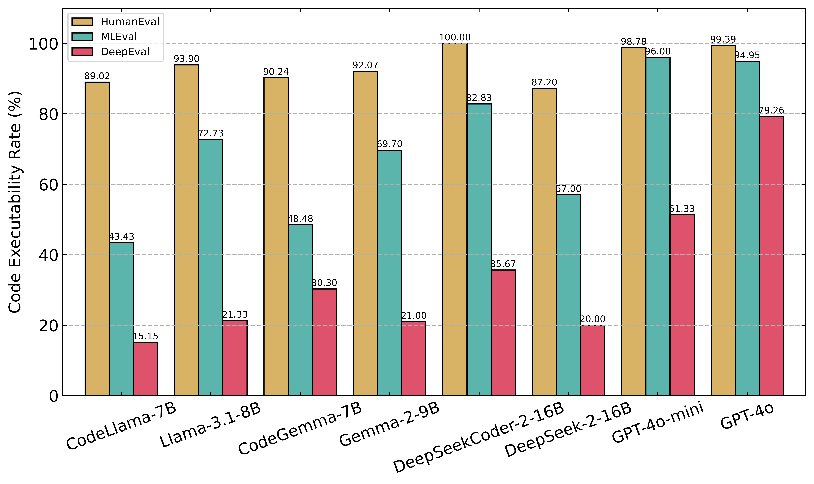

# How Do Large Language Models Perform in Deep Learning Code Generation? A Benchmark and Empirical Study
DeepEval is the first deep learning code generation benchmark described in the paper "How Do Large Language Models Perform in Deep Learning Code Generation? A Benchmark and Empirical Study". 
## Benchmark
DeepEval is constructed munally and saved the YAML format in ```./benchmark/DeepEval```. DeepEval consists of 100 DL programming tasks, each associated with a *Requirement* and a *Reference Code*. The *Requirement* provides a detailed task requirement, including dataset and model structure. The *Reference Code* is
a correct task implementation, serving as a reference for evaluating the generated code.

## Promptings:
We adapt four prompting methods to LLMs, as seen in ```./prompts/deepeval```. all promptings use the same example, randomly selected from DeepEval, to ensure a fair comparison.<br>
• Zero-shot Prompting [11] directly provides our task require
ment to the LLMs without examples.<br>
• One-shot Prompting [11] includes an example with the form
of <example task, example code> pair.<br>
• One-shot Chain-of-Thought Prompting (oneshot-cot prompting) [57]
is a variant of one-shot prompting that generates a chain-of-thought
(CoT) for the example task. The prompting includes one example with the form of <example task, CoT, example code> triple.<br>
• Few-shot Prompting [9] includes multiple examples with the
form of <example task, example code> pairs.
## Studied LLMs
| Type       | Model                                   | Size | Team     | Source | Access method   |
|------------|-----------------------------------------|------|----------|--------|-----------------|
| General LLM| GPT-4o                                  | -    | OpenAI   | Closed | Official API    |
|            | GPT-4o mini                             | -    | OpenAI   | Closed | Official API    |
|            | DeepSeek-V2-Lite-Chat                   | 16B  | DeepSeek | Open   | HuggingFace     |
|            | Gemma-2-9B-Instruct                     | 9B   | Google   | Open   | HuggingFace     |
|            | Llama-3.1-8B-Instruct                   | 8B   | Meta     | Open   | HuggingFace     |
| Code LLM   | DeepSeek-Coder-V2-Lite-Instruct         | 16B  | DeepSeek | Open   | HuggingFace     |
|            | Codellama-7B-Instruct                   | 7B   | Meta     | Open   | HuggingFace     |
|            | CodeGemma-7B-Instruct                   | 7B   | Google   | Open   | HuggingFace     |

## Usage
Ensure you're using the right setup and following the proper directory structure to seamlessly evaluate deep learning code generation with our tool.
### 🛠️ Setup
1. Repository Setup
Clone the repository and install necessary dependencies:
```
$ git clone https://github.com/maxy-635/DeepEval.git
```
2. Path
To set up the project, you need to add the project directory to your `PYTHONPATH`. You can do this by running the following command:
```bash
export PYTHONPATH=$PYTHONPATH:/your_local_path/DeepEval
```
1. Code Generation
   | Step                    | Command                             |
   | ------------------------| -------------------------------------- |
   | 1. Create Environment   | `conda create -n DeepEval python=3.10` |
   | 2. Activate Environment | `conda activate DeepEval`            |
   | 3. Install Dependencies | `conda install environment_deepeval.yml`|
   | 4. Run HuggingFace Model| `bash run_hf.sh`                       |
   | 5. Run OpenAI Model     | `bash run_api.sh`                      |   
2. Code Evaluation
   | Benchmark                     | Environment Configuration                          |Command |
   | ------------------------| -------------------------------------- |----|
   | DeepEval |1.`conda create -n DeepEval python=3.10`<br>2.`conda activate DeepEval`<br>3.`conda install environment_deepeval.yml`|`python syntatic_checking_main.py` (RQ2);<br>`python semantic_checking_main.py` (RQ3);<br>`dynamic_checking_deepeval_main.py` (RQ1,RQ4)|
   | HumanEval | 1.`conda create -n HumanEval python=3.10`<br>2.`conda activate HumanEval`<br>3.`conda install environment_humaneval.yml`<br>|`python dynamic_checking_humaneval_main.py` (RQ1)|
   | MLEval  | 1.`conda create -n MLEval python=3.10`<br>`2.conda activate MLEval`<br>3.`conda install environment_mleval.yml`<br>|`dynamic_checking_mleval_main.py` (RQ1)|
## Implementation
As listed as follows, we adhere to the specified experimental settings throughout the process. Finally, 1200 DL programs are generated for each LLM under four different promptings on 100 DL code generation tasks in DeepEval.
| Parameter Name         | Value or Description                                                     |
|------------------------|--------------------------------------------------------------------------|
| Sampling Method        | Nucleus Sampling                      |
| Temperature            | 0.8                                   |
| Top-p Value            | 0.95                                  |
| Hardware               | 2 × NVIDIA V100 GPUs                  |
| Repeat times           | 3                                     |

## Results:
### RQ1: Benchmark Effectiveness
 <br>
### RQ2: Code Syntax
<br>
### RQ3: Code Semantics
<br>
### RQ4: Code Executability
<br>
## Contributing

If you would like to contribute to DeepEval, please fork the repository and submit a pull request. We welcome all contributions!

## License

This repository is under [MIT](https://github.com/FudanSELab/ClassEval/blob/master/LICENSE) license. But the data is distributes through [CC BY-NC 4.0](https://creativecommons.org/licenses/by-nc/4.0/) license.

<!-- ## Contact

For any questions or inquiries, please contact the project maintainer at [xiangy_ma@buaa.edu.cn)](xiangy_ma@buaa.edu.cn)). -->
